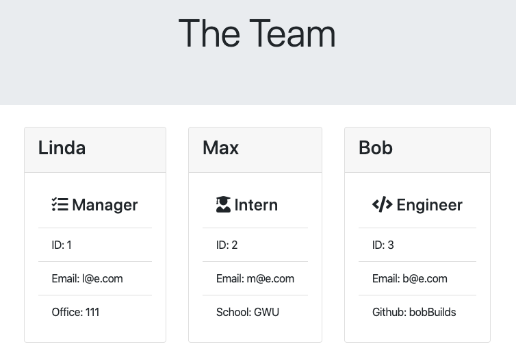

# Team-Summary

## Description

Team-Summary is a CLI application that prompts a user to enter information about their team. Once the user has entered the information, Team-Summary generates an html file populated with the input received from the user.

## Screenshot

